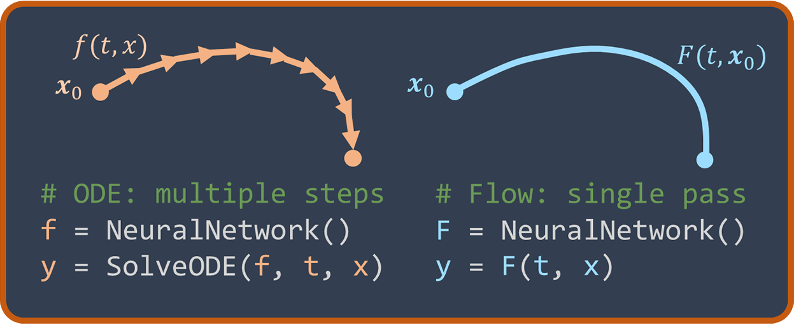

# Neural Flows: Efficient Alternative to Neural ODEs [[arxiv](https://arxiv.org/abs/2110.13040)]

*TL;DR:* We directly model the neural ODE solutions with neural flows, which is much faster and achieves better results on time series applications, since it avoids using expensive numerical solvers.



Marin Biloš, Johanna Sommer, Syama Sundar Rangapuram, Tim Januschowski, Stephan Günnemann

*Abstract*: Neural ordinary differential equations describe how values change in time. This is the reason why they gained importance in modeling sequential data, especially when the observations are made at irregular intervals. In this paper we propose an alternative by directly modeling the solution curves - the flow of an ODE - with a neural network. This immediately eliminates the need for expensive numerical solvers while still maintaining the modeling capability of neural ODEs. We propose several flow architectures suitable for different applications by establishing precise conditions on when a function defines a valid flow. Apart from computational efficiency, we also provide empirical evidence of favorable generalization performance via applications in time series modeling, forecasting, and density estimation.

This repository acts as a supplementary material which implements the models and experiments as described in the main paper. The definition of models relies on the [stribor](https://github.com/mbilos/stribor) package for normalizing and neural flows. The baselines use [torchdiffeq](https://github.com/rtqichen/torchdiffeq) package for differentiable ODE solvers.


## Installation

Install the local package `nfe` (which will also install all the dependencies):
```
pip install -e .
```

## Download data

Download and preprocess real-world data and generate synthetic data (or run commands in `download_all.sh` manually):
```
. scripts/download_all.sh
```
Many experiments will automatically download data if it's not already downloaded so this step is optional.

Note: [MIMIC-III](https://physionet.org/content/mimiciii/1.4/) and [IV](https://physionet.org/content/mimiciv/1.0/) have to be downloaded manually. Use notebooks in [`data_preproc`](nfe/experiments/gru_ode_bayes/data_preproc) to preprocess data.


After downloading everything, your directory tree should look like this:
```
├── nfe
│   ├── experiments
│   │   ├── base_experiment.py
│   │   ├── data
│   │   │   ├── activity
│   │   │   ├── hopper
│   │   │   ├── mimic3
│   │   │   ├── mimic4
│   │   │   ├── physionet
│   │   │   ├── stpp
│   │   │   ├── synth
│   │   │   └── tpp
│   │   ├── gru_ode_bayes
│   │   ├── latent_ode
│   │   ├── stpp
│   │   ├── synthetic
│   │   └── tpp
│   ├── models
│   └── train.py
├── scripts
│   ├── download_all.sh
│   └── run_all.sh
└── setup.py
```

## Models

Models are located in [`nfe/models`](nfe/models). It contains the [implementation](nfe/models/flow.py) of `CouplingFlow` and `ResNetFlow`. The ODE models and continuous (ODE or flow-based) GRU and LSTM layers can be found in the same directory.

### Example: Coupling flow

```python
import torch
from nfe import CouplingFlow

dim = 4
model = CouplingFlow(
    dim,
    n_layers=2, # Number of flow layers
    hidden_dims=[32, 32], # Hidden layers in single flow
    time_net='TimeLinear', # Time embedding network
)

t = torch.rand(3, 10, 1) # Time points at which IVP is evaluated
x0 = torch.randn(3, 1, dim) # Initial conditions at t=0

xt = model(x0, t) # IVP solutions at t given x0
xt.shape # torch.Size([3, 10, 4])
```

### Example: GRU flow

```python
import torch
from nfe import GRUFlow

dim = 4
model = GRUFlow(
    dim,
    n_layers=2, # Number of flow layers
    hidden_dims=[32, 32], # Hidden layers in single flow
    time_net='TimeTanh', # Time embedding network
)

t = torch.rand(3, 10, 1) # Time points at which IVP is evaluated
x = torch.randn(3, 10, dim) # Initial conditions, RNN inputs

xt = model(x, t) # IVP solutions at t_i given x_{1:i}
xt.shape # torch.Size([3, 10, 4])
```


## Experiments

Run all experiments: `. scripts/run_all.sh`. Or run individual commands manually.

### Synthetic

Example:
```
python -m nfe.train --experiment synthetic --data [ellipse|sawtooth|sink|square|triangle] --model [ode|flow] --flow-model [coupling|resnet] --solver [rk4|dopri5]
```

### Smoothing

Example:
```
python -m nfe.train --experiment latent_ode --data [activity|hopper|physionet] --classify [0|1] --model [ode|flow] --flow-model [coupling|resnet]
```

Reference:

- Yulia Rubanova, Ricky Chen, David Duvenaud. "Latent ODEs for Irregularly-Sampled Time Series" (2019) [[paper]](https://arxiv.org/abs/1907.03907). We adapted the [code](nfe/experiments/latent_ode/) from [here](https://github.com/YuliaRubanova/latent_ode).

### Filtering

Request [MIMIC-III](https://physionet.org/content/mimiciii-demo/1.4/) and [IV](https://physionet.org/content/mimiciv/1.0/) data, and download locally. Use [notebooks](nfe/experiments/gru_ode_bayes/data_preproc) to preprocess data.

Example:
```
python -m nfe.train --experiment gru_ode_bayes --data [mimic3|mimic4] --model [ode|flow] --odenet gru --flow-model [gru|resnet]
```

Reference:

- Edward De Brouwer, Jaak Simm, Adam Arany, Yves Moreau. "GRU-ODE-Bayes: Continuous modeling of sporadically-observed time series" (2019) [[paper]](https://arxiv.org/abs/1905.12374). We adapted the [code](nfe/experiments/gru_ode_bayes) from [here](https://github.com/edebrouwer/gru_ode_bayes).

### Temporal point process

Example:
```
python -m nfe.train --experiment tpp --data [poisson|renewal|hawkes1|hawkes2|mooc|reddit|wiki] --model [rnn|ode|flow] --flow-model [coupling|resnet] --decoder [continuous|mixture] --rnn [gru|lstm] --marks [0|1]
```

Reference:

- Junteng Jia, Austin R. Benson. "Neural Jump Stochastic Differential Equations" (2019) [[paper]](https://arxiv.org/abs/1905.10403). We adapted the [code](nfe/experiments/tpp) from [here](https://github.com/000Justin000/torchdiffeq/tree/jj585).

### Spatio-temporal

Example:
```
python -m nfe.train --experiment stpp --data [bike|covid|earthquake] --model [ode|flow] --density-model [independent|attention]
```

Reference:

- Ricky T. Q. Chen, Brandon Amos, Maximilian Nickel. "Neural Spatio-Temporal Point Processes" (2021) [[paper]](https://arxiv.org/abs/2011.04583). We adapted the [code](nfe/experiments/stpp) from [here](https://github.com/facebookresearch/neural_stpp).


## Citation

```
@article{bilos2021neuralflows,
  title={{N}eural Flows: {E}fficient Alternative to Neural {ODE}s},
  author={Bilo{\v{s}}, Marin and Sommer, Johanna and Rangapuram, Syama Sundar and Januschowski, Tim and G{\"u}nnemann, Stephan},
  journal={Advances in Neural Information Processing Systems},
  year={2021}
}
```
